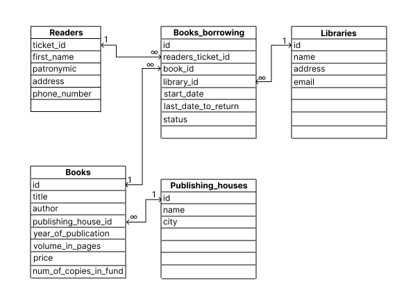

# Database-plan-1T-Data-training

## Сущности
Было определено 5 сущностей:
- Читатели
- Книги
- Издательства
- Библиотеки
- Выдача книг

## Ключи
Первичным ключом для Readers является id билета (читательского), у остальных это просто id
Внешних ключей нет у Readers, Libraries и Publishing_houses
У книг есть внешний ключ на издательский дом, у взятия книги есть ключи на читателя, библиотеку и книгу, которую в библиотеке выдали читателю

## Связи
В данной схеме используются связи **1 ко многим**, где, например, у одного издательского дома есть множество книг, но одна книга принадлежит только одному издательскому дому.
Другой пример: У одного читателя, библиотеки, книги может быть множество взятий книг, но это событие принадлежит конкретно к одному читателю, книге и библиотеке
